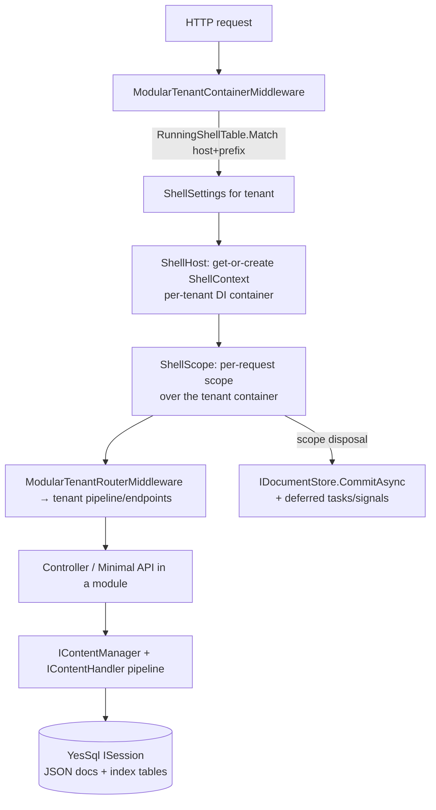

# System Map

## Repo shape: one solution, three tiers

Orchard Core is a **single .NET solution** (`OrchardCore.slnx`) with ~200 projects arranged in three tiers, plus a Yarn 4 workspace for frontend assets.

```
OrchardCore/
├── src/
│   ├── OrchardCore.Cms.Web/          # HOST: the runnable CMS app (~20-line Program.cs)
│   ├── OrchardCore.Mvc.Web/          # HOST: minimal modular-MVC sample host
│   ├── OrchardCore.AspireHost/       # HOST: .NET Aspire orchestration
│   ├── OrchardCore/                  # TIER 1: ~104 framework libraries
│   │   ├── OrchardCore.Abstractions/         # shell, scopes, background tasks, modules
│   │   ├── OrchardCore/                      # kernel impl: ShellHost, middlewares, background service
│   │   ├── OrchardCore.ContentManagement*/   # content model, display, GraphQL
│   │   ├── OrchardCore.Data.YesSql/          # persistence wiring
│   │   ├── OrchardCore.DisplayManagement*/   # shapes, drivers, Liquid
│   │   └── ...Abstractions/.Core pairs for most modules
│   ├── OrchardCore.Modules/          # TIER 2: ~95 feature modules (each a mini-app)
│   │   ├── OrchardCore.Contents/     # content CRUD UI + API
│   │   ├── OrchardCore.Users/        # identity, login, 2FA
│   │   ├── OrchardCore.Autoroute/    # slug routing
│   │   └── ...
│   ├── OrchardCore.Themes/           # TIER 3: themes (templates/assets only)
│   ├── Frontend/                     # shared JS/TS assets (Yarn workspace)
│   └── docs/                         # mkdocs documentation site
└── test/
    ├── OrchardCore.Tests/            # xUnit v3 unit tests
    ├── OrchardCore.Tests.Functional/ # Playwright E2E, in-process host
    └── OrchardCore.Tests.Integration / .Modules / .Benchmarks / ...
```

Verified by directory listing (see [../09-reference/verification-log.md](../09-reference/verification-log.md)).

## The runtime shape (the part interviews care about)



- Tenant resolution and container swap: [`src/OrchardCore/OrchardCore/Modules/ModularTenantContainerMiddleware.cs:27-69`](../../../src/OrchardCore/OrchardCore/Modules/ModularTenantContainerMiddleware.cs)
- Per-tenant container creation (lazy, semaphore-guarded): [`src/OrchardCore/OrchardCore/Shell/ShellHost.cs:80-119`](../../../src/OrchardCore/OrchardCore/Shell/ShellHost.cs)
- Commit-on-scope-end unit of work: [`src/OrchardCore/OrchardCore.Data.YesSql/OrchardCoreBuilderExtensions.cs:152-170`](../../../src/OrchardCore/OrchardCore.Data.YesSql/OrchardCoreBuilderExtensions.cs)

## Ownership map

| Concern | Who owns it | Anchor |
| --- | --- | --- |
| Host bootstrap | `OrchardCore.Cms.Web` | [`Program.cs:1-23`](../../../src/OrchardCore.Cms.Web/Program.cs) |
| Tenant lifecycle (create/reload/release) | `ShellHost` in kernel | [`ShellHost.cs:16-30`](../../../src/OrchardCore/OrchardCore/Shell/ShellHost.cs) |
| Tenant config storage | `ShellSettings` (`App_Data/tenants.json` + per-site `appsettings.json`) | [`ShellSettings.cs:9-13`](../../../src/OrchardCore/OrchardCore.Abstractions/Shell/ShellSettings.cs) |
| Content domain logic | `OrchardCore.ContentManagement` (framework lib, not the module) | [`DefaultContentManager.cs:19`](../../../src/OrchardCore/OrchardCore.ContentManagement/DefaultContentManager.cs) |
| Content admin UI + HTTP API | `OrchardCore.Contents` module | [`Controllers/AdminController.cs`](../../../src/OrchardCore.Modules/OrchardCore.Contents/Controllers/AdminController.cs), [`Endpoints/Api/CreateEndpoint.cs`](../../../src/OrchardCore.Modules/OrchardCore.Contents/Endpoints/Api/CreateEndpoint.cs) |
| Persistence | `OrchardCore.Data.YesSql` + per-module `Migrations.cs` and `*Index.cs` | [`OrchardCoreBuilderExtensions.cs:33`](../../../src/OrchardCore/OrchardCore.Data.YesSql/OrchardCoreBuilderExtensions.cs) |
| UI rendering | `OrchardCore.DisplayManagement*` + per-module `Drivers/`, `Views/`, `placement.json` | [`ContentItemDisplayManager.cs:21`](../../../src/OrchardCore/OrchardCore.ContentManagement.Display/ContentItemDisplayManager.cs) |
| Identity/auth | `OrchardCore.Users` module + ASP.NET Identity | [`AccountController.cs:24`](../../../src/OrchardCore.Modules/OrchardCore.Users/Controllers/AccountController.cs) |
| Authorization | `OrchardCore.Security*` + per-module `Permissions.cs` + dynamic handlers | [`ContentTypeAuthorizationHandler.cs:10`](../../../src/OrchardCore.Modules/OrchardCore.Contents/Security/ContentTypeAuthorizationHandler.cs) |
| Background work | `ModularBackgroundService` (kernel) + per-module `IBackgroundTask` | [`ModularBackgroundService.cs:17`](../../../src/OrchardCore/OrchardCore/Modules/ModularBackgroundService.cs) |
| Import/export | `OrchardCore.Recipes*` + `OrchardCore.Deployment*` | [`RecipeExecutor.cs:16`](../../../src/OrchardCore/OrchardCore.Recipes.Core/Services/RecipeExecutor.cs) |

## Public interfaces vs private internals

**Public (contract — changing these has wide blast radius):**
- NuGet package surface: everything in `src/OrchardCore/*Abstractions` — interfaces like `IContentManager`, `IShellHost`, `IDisplayDriver`. Orchard ships these as packages; downstream sites compile against them.
- HTTP: admin routes declared via `[Admin("...")]` attributes (e.g. [`AdminController.cs:66`](../../../src/OrchardCore.Modules/OrchardCore.Contents/Controllers/AdminController.cs)), minimal-API `api/content` endpoints, GraphQL schema.
- Recipe/deployment JSON step formats; Liquid template surface; shape names and alternates (themes depend on them).

**Private (freely refactorable):** module `Services/` internals, `ViewModels/`, index providers' mapping logic — anything not exported through an Abstractions package or rendered contract.

A useful senior habit this repo rewards: before changing anything, ask *"is this symbol part of a shipped package or template contract?"* The `Abstractions`/implementation split makes the answer mostly legible from the project name.

## Drill

Without looking, sketch the mermaid diagram above from memory, then diff against the original. Self-grade: **Basic** = middleware→container→controller→db. **Solid** = adds ShellScope + commit-at-disposal. **Strong** = adds where deferred tasks run and why the container is per-tenant (isolation boundary: features, DI registrations, and DB table prefix all vary per tenant).
